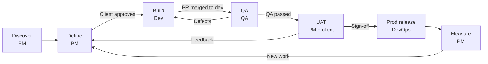

# Gen Clover workflow

Every stage has **one owner**, **a document with an ID**, and **a gate** that must be passed before the
next stage starts. Production releases count as *delivered*; billing follows logged hours wherever
the work stands.

## Stages and gates

| Stage | Owner | Output (ID) | Gate |
|---|---|---|---|
| Discover | PM | Discovery brief `DISC`, stakeholders, risks | Client confirms the brief in writing |
| Define | PM | Work items (`REQ`, `CR`) with acceptance criteria and estimates; release milestone; `ADR` for big items (Dev lead) | **Client approves each item and its estimate** |
| Build | Dev | Branch, PR into `dev`, unit tests, docs; QA repo test cases updated | CI green, review approved |
| QA | QA | Automated run report, manual results, defects `BUG` | All acceptance criteria pass; no open P1 defects |
| UAT | PM + client | UAT build `vX.Y.Z-uat.n`, UAT notes `UAT` | **Client sign-off `SO`** |
| Prod release | DevOps | Tag `vX.Y.Z`, release notes, `CHANGELOG.md`, cutover and rollback steps | Production smoke test passes |
| Measure | PM | Monthly report | Reviewed with client |
| Maintain | DevOps | Updates, backups, incident log | Monthly health check |

UAT feedback goes back to **Define**, not straight to Dev: each point is classified first (below), so
extra work is visible and billable.

## Requirement, change request or defect?

**A change request changes something the client already approved or received.** Everything else new
is a requirement; anything that breaks an agreed promise is a defect. Ask in this order:

1. Does it fail something we agreed and delivered? → **Defect** (`BUG`)
2. Does it change something the client already approved or received? → **Change request** (`CR`)
3. Otherwise → **Requirement** (`REQ`)

| Type | Approval | Billing |
|---|---|---|
| Requirement | Client approves item + estimate | Billable |
| Change request | Client approves the change + impact on estimate and dates | Billable |
| Defect | None; PM prioritises | Per contract (hourly: usually billable; fixed price/warranty: usually not) |
| Task (discovery, QA round, UAT, release, PM time) | Part of the approved plan | Per contract |

When in doubt the PM decides and writes one line of reasoning in the issue. **Nothing is built
before it is Approved.**

## Environments

| Environment | Branch | Used for | Who sees it |
|---|---|---|---|
| Feature previews | `feature/*`, `fix/*` | Development | Dev |
| Dev | `dev` | QA testing | Gen Clover |
| UAT | `uat` | Client acceptance | Gen Clover + client |
| Production | `main` | Live use | Client users |

Flow of code: `feature/*` → PR → `dev` → (QA passed) → `uat` tagged `vX.Y.Z-uat.n` → (sign-off) →
`main` tagged `vX.Y.Z`. Nobody pushes directly to `dev`, `uat` or `main`.

## Status of a work item (project board)

Backlog → Approved → In dev → In QA → In UAT → Released · Cancelled

## Hours

Everyone (PM, Dev, QA, DevOps) logs time daily against an issue number. Non-development work has its
own Task issues (discovery, QA round, UAT, release, PM per month, support per month). See
[`templates/timesheet.md`](templates/timesheet.md).

## Where things are saved

| What | Where |
|---|---|
| Rules, templates, Claude skills, registry | `gen-clover/playbook` |
| Code, unit tests, technical docs, `CHANGELOG.md`, work items (issues) | Code repo, e.g. `gen-clover/seg` |
| Test cases, end-to-end tests, QA runs, bug sheets | QA repo, e.g. `gen-clover/seg-qa` |
| Client documents (brief, scope, UAT notes, sign-offs, release and client packs) | Delivery repo, e.g. `gen-clover/abr-delivery` |
| Drafts worked on with Claude | Claude docs (export when final) |
| Hours | Time sheet (Google Sheet), exported monthly |
| Rates, invoices, contracts | Accounting tool + restricted Drive folder — **never GitHub** |

## Improving this playbook

When a rule is unclear, doesn't fit, or had to be worked around, open a **Playbook feedback** issue in
`gen-clover/playbook` (Claude offers to do this). Issues are triaged after each release; a new playbook
version is released monthly at most and synced into every active project repo.
